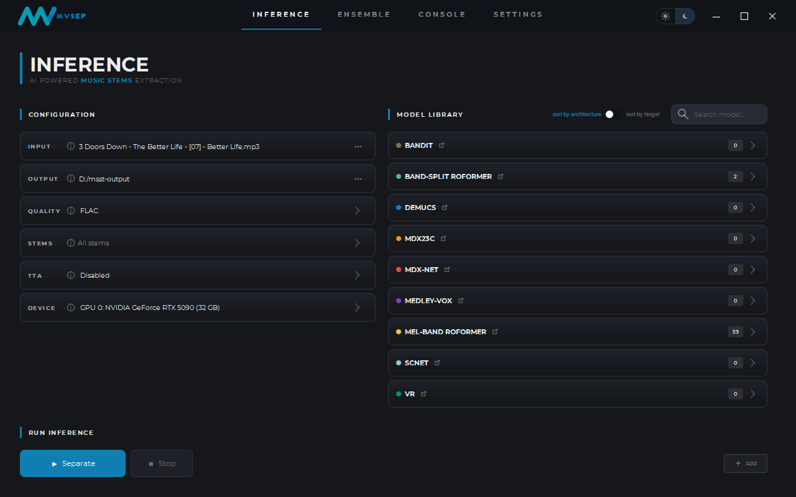

# MSST GUI

A modern desktop GUI for [Music-Source-Separation-Training](https://github.com/ZFTurbo/Music-Source-Separation-Training) (MSST) by ZFTurbo, built with PySide6 and styled after [mvsep.com](https://mvsep.com).

Separate audio into stems (vocals, instrumental, drums, bass, guitar, piano, …) with state-of-the-art Roformer, MDX, Demucs, SCNet, Apollo and Bandit models — no command line required.



## Features

- **Inference** — drop or browse audio files, pick a model from the library (grouped by architecture), choose quality (WAV / FLAC / MP3), stems, TTA and device (GPU/CPU auto-detected).
- **Auto Ensemble** — select a target stem type and every compatible registered model is combined automatically.
- **Manual Ensemble** — combine custom model outputs with per-file weights and selectable ensemble algorithms.
- **Iterative Ensemble** — multi-pass refinement through local models and the MVSep API for maximum-spec results.
- **Console** — live processing log plus per-song result cards with color-coded stem waveforms, playback and output file access.
- **Model Manager** — browse the community model index straight from HuggingFace, download with progress tracking, or register local checkpoints / download from a URL.
- **Dark & light theme** with a one-click switch (mvsep.com-styled palettes, bundled Montserrat font).
- Native-window feel: frameless chrome, edge resizing, maximize/restore — and a settings editor for per-checkpoint parameters.

## Requirements

- Windows 10/11 (tested); anything that runs PySide6 + PyTorch should work
- Python 3.10+ (3.11 recommended)
- NVIDIA GPU with CUDA for GPU inference (CPU-only works too, just slower)

## Installation

### Quick (Windows)

1. Run `run_install.bat` — creates a virtual environment, installs all dependencies and PyTorch with CUDA 12.1 support.
2. Run `run_gui.bat` to start the GUI.

### Manual

```bash
python -m venv .venv
.venv\Scripts\activate
pip install -r requirements_gui.txt
# GPU (CUDA 12.1) build of PyTorch:
pip install torch torchaudio --index-url https://download.pytorch.org/whl/cu121
python main.py
```

## Getting models

Open **Settings → Register Model → Model Manager** to browse the community model index from HuggingFace and download models with one click. Alternatively register a local checkpoint (**Local Files**) or fetch one from a direct URL (**Download from URL**).

Downloads and registered models are stored under `models/`; your settings and registrations live in `msst_settings.json` (both are user data — keep them out of any published repo, see `.gitignore`).

## Standalone exe

Build a self-contained Windows app with:

```bash
python tools/prepare_runtime.py   # once: bundles an embedded Python (pip included)
pyinstaller MSST-GUI.spec --noconfirm
```

Or everything in one step (app + installer, requires [Inno Setup 6](https://jrsoftware.org/isinfo.php)):

```bash
tools\build_all.bat
```

The result in `dist/MSST-GUI/` needs no Python installed; `MSST-GUI-Setup-*.exe` is a per-user installer (Start-menu + optional desktop shortcuts, clean uninstaller that preserves your models and settings). Separation jobs run under a private runtime (`runtime/` next to the exe) that is provisioned on first use:

- RTX 50-series and newer → PyTorch CUDA 12.8 wheels
- GTX 10-series through RTX 40-series → PyTorch CUDA 12.1 wheels
- no NVIDIA GPU → CPU wheels

One PyTorch build cannot cover both Pascal and Blackwell, so the download (~2.5–3 GB, once) is picked for the detected GPU when you start your first job.

## Project layout

```
├── main.py               # GUI entry point
├── inference.py          # separation runner (spawned per job)
├── ensemble.py           # ensemble runner
├── ui/                   # PySide6 interface (pages, widgets, theme)
├── backend/              # runners, model manager, settings store, MVSep client
├── models/               # per-architecture model code + your checkpoints
├── configs/              # model YAML configs
├── utils/                # audio helpers
├── resources/            # fonts, icons, global stylesheet
└── tests/                # pytest suite
```

## Troubleshooting & logs

The app writes `msst-gui.log` next to the executable (rotated at 2 MB). It
captures Python errors, Qt warnings and the update check. To see output live
in your terminal instead:

```bash
MSST-GUI.exe --console
```

## Running tests

```bash
pytest tests
```

## Credits

- [Roman Solovyev (ZFTurbo)](https://github.com/ZFTurbo/) — [Music-Source-Separation-Training](https://github.com/ZFTurbo/Music-Source-Separation-Training), inference & ensemble tooling
- [mvsep.com](https://mvsep.com) — visual design reference
- [Montserrat](https://fonts.google.com/specimen/Montserrat) — bundled font, SIL Open Font License 1.1
- neo for supplying 99% of the sourcecode
